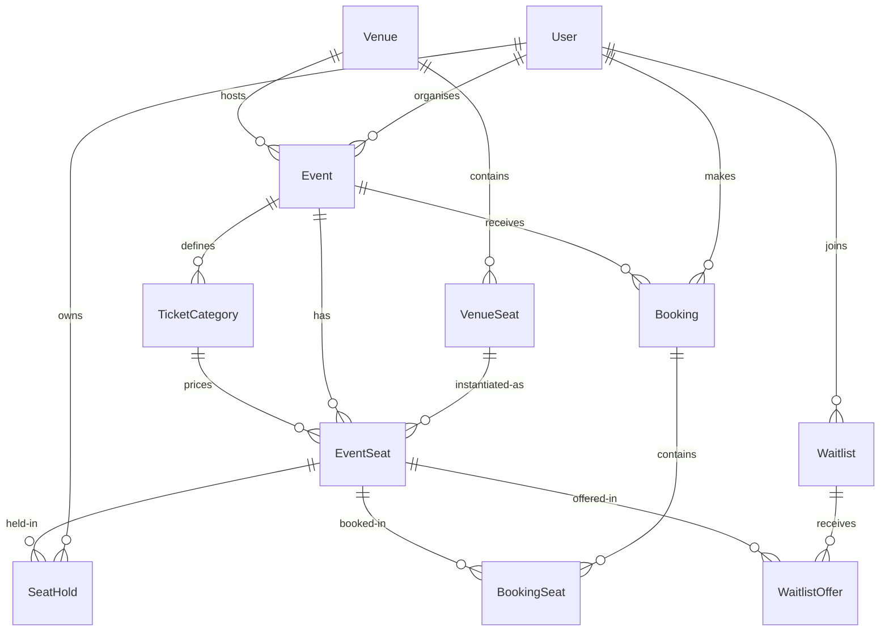

# Ticket Booking System - System Design Document

This document explains the technical architecture, data model, and state-machine logic for the Ticket Booking System.

---

## 1. Data Model & Relationships

The database schema is implemented using PostgreSQL (via Prisma ORM) and acts as the single source of truth.



### Core Entities:
- **User**: Stores credentials and role-based permissions (`CUSTOMER`, `ORGANISER`, `ADMIN`).
- **Venue & VenueSeat**: Represents the master architectural layout template (configured by Admins).
- **Event**: Created by Organisers, specifying the title, description, time, and venue.
- **TicketCategory**: Defines seat categories (Premium, Standard, Economy) and prices for an event.
- **EventSeat**: Real-time instance of a venue seat for a specific event. Tracks seat status: `AVAILABLE`, `HELD`, or `BOOKED`.
- **SeatHold**: Represents a temporary reservation with an expiration timestamp.
- **Booking & BookingSeat**: Represents confirmed ticket sales and booking references (`TBS-YYYY-XXXXXX`).
- **Waitlist & WaitlistOffer**: Manages FIFO queue positions for sold-out ticket categories and temporary ticket offers.

---

## 2. Seat Hold & TTL Expiration State Machine

Temporary seat locking ensures that a customer has dedicated access to select seats for **10 minutes** during checkout.

```
       +-------------+
       |  AVAILABLE  | <------------------------------------+
       +-------------+                                      |
              |                                             |
              | (Customer holds seat)                       |
              v                                             | (Expired offer /
       +-------------+                                      |  no waitlist)
       |    HELD     |                                      |
       +-------------+                                      |
        /           \                                       |
       /             \                                      |
(Checkout)     (Hold Expired / Released)                    |
     /                 \                                    |
    v                   v                                   |
+------------+    +-------------+                           |
|   BOOKED   |    | check queue | ---- (Waitlist exists) ---+
+------------+    +-------------+
                         |
                         | (Create 10-min offer)
                         v
                  +-------------+
                  |   OFFERED   | (Waitlist customer claims)
                  +-------------+ -------------------------> Confirmed Booking
```

- **TTL Check & Release**: Hold expiration is enforced at the server level via **on-demand checkups** (triggered whenever the seat map, booking, or waitlist endpoints are hit) and a **background cron job** (`/api/cron/cleanup`) running every minute.
- **Concurrency Prevention**: Dual-locking attempts on the same seat are resolved using database row-level isolation and atomic updates:
  ```sql
  UPDATE "EventSeat" SET "status" = 'HELD' WHERE "id" = :seatId AND "status" = 'AVAILABLE' RETURNING *;
  ```
  If zero rows are affected, the seat was already locked by another concurrent transaction, and a conflict error is returned to the second client.

---

## 3. FIFO Waitlist System & Automatic Offer Assignment

When tickets for a specific category are sold out, customers can join a First-In-First-Out (FIFO) queue.

1. **Joining the Queue**: A customer registers a waitlist record. Their initial queue position is computed as:
   $$\text{Queue Position} = \text{Count of existing } \text{WAITING} \text{ users in the category} + 1$$
2. **Cancellation or Expiration**: When a booking is cancelled or a hold expires, the database transaction triggers the waitlist reassigner.
3. **Offer Generation**: The reassigner fetches the oldest active waitlist record (`queuePosition` = 1, `status = WAITING`).
   - Rather than booking the ticket automatically, the system creates a **10-minute temporary offer** (`WaitlistOffer`).
   - The waitlisted customer is sent an email containing a secure checkout link (`/customer/waitlist?offerId=...`).
   - The seat status remains `HELD` during this period to prevent public bookings.
4. **Accept or Decline**:
   - If the customer **accepts** and completes payment, the seat status changes to `BOOKED` and the waitlist status is marked as `COMPLETED`.
   - If the customer **declines** or the timer **expires**, the offer and waitlist entries are set to `EXPIRED`. The reassigner automatically queries the next person in queue, starts a new 10-minute timer, and sends an email.

---

## 4. Real-Time Seat Map Polling

Since serverless functions are stateless, persistent WebSockets are replaced with client-side **short polling** (every 3 seconds) on the active booking screen.
- Every poll request triggers the on-demand database TTL cleanup.
- This ensures that seat map grids reflect live status changes (held by others, booked, or released) instantly.

---

## 5. Security & JWT Session Flow

Authentication is managed via JSON Web Tokens (JWT) stored in HTTP-Only, Secure, Lax cookies.
- **Role-Based Access Control (RBAC)**: Enforced via server-side verification helpers. Admin features (venue building, user audits) and Organiser controls (event creation, analytics) are strictly restricted.
- **Password Protection**: Hashed using `bcryptjs` (Blowfish-based cipher) with a cost factor of 10. Plaintext passwords are never stored or exposed.
